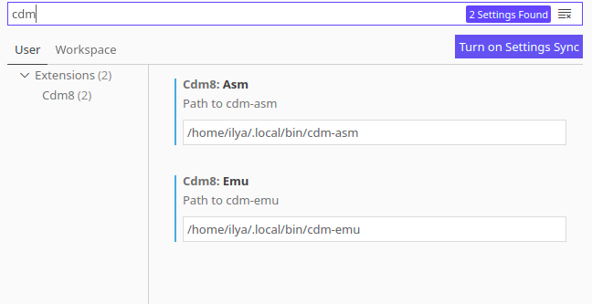
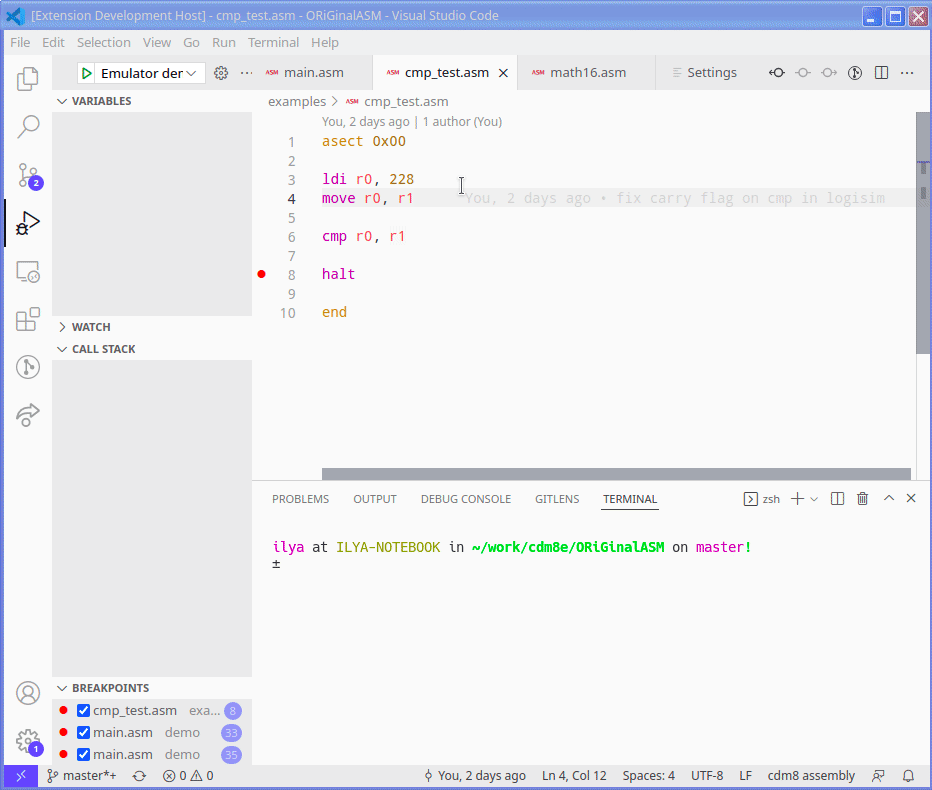
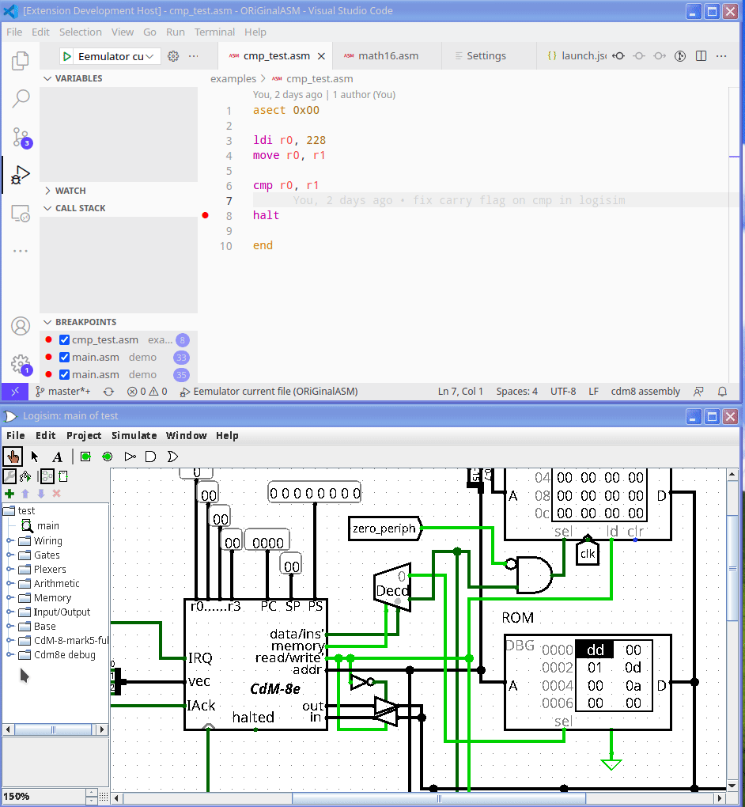

# Cdm8 extended

This repository contains cdm8e processor implemented in logisim, cdm8e assembler and cdm8e emulator.
## Installation
1. Install python 3.10 or higher, VS Code and logisim
2. Download [logisim circuit](https://github.com/leadpogrommer/Cdm8-asm/releases/download/latest/CdM-8-mark5-full.circ) and [python package](https://github.com/leadpogrommer/Cdm8-asm/releases/download/latest/cdm8-0.1.0-py3-none-any.whl)
3. Install python package (`pip install cdm8-0.1.0-py3-none-any.whl`)
4. Install [cdm8-asm](https://marketplace.visualstudio.com/items?itemName=leadpogrommer.cdm8-asm) VS Code extension
5. Go to VS Code preferences, search from `cdm` and set **ABSOLUTE** path to `cdm_asm` and `cdm_emu`
   
6. Next steps are needed only if you want to debug programs in logisim
7. Download [logisim debug library](https://github.com/leadpogrommer/logisim_debug/releases/download/latest/logisim-debug-1.0-SNAPSHOT-all.jar)
8. Build you circuit with cdm8e. Circuit must meet following requirements
   - Circuit must use `logisim_debug` library
   - Cdm8e must be on top level
   - Circuit should have exactly one `debug ROM` and one `debug RAM`
   [example circuit](https://github.com/leadpogrommer/logisim_debug/raw/master/test.circ)

## Usage
### Running `.asm` files in emulator
1. Open `.asm` file in VS Code
2. Open command palette (`Ctrl+Shift+P` by default) and type `Select and start debugging`
3. Select `Cdm8 debugger`
4. Select `Emulator current file`

### Running `.asm` files in logisim
1. Open your circuit in logisim
2. Select `Cdm8e debug -> Debug tool` on tool panel. A message indicating that server has started should appear
3. Repeat steps from previous paragraph, except on the last step choose `Logisim current file`

## Documentation
Documentation for cdm8e architecture and assembler is [here](https://github.com/leadpogrommer/Cdm8-asm/raw/master/docs/main.pdf)
